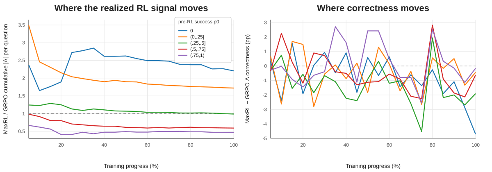

# RLVR Signal Allocation and Behavioral Change

In RLVR, each training problem produces a group of sampled responses; their rewards determine the advantage weights used in policy updates. This project asks **how closely the timing and allocation of this problem-level training signal correspond to where correctness improves**.

The goal is to assess what these training records tell us about the beneficiaries of an update: does a problem's own participation, or greater weighting of problems like it, correspond to larger gains on those problems?

I follow a fixed panel of 256 problems from the GSM8K training set through 20 checkpoints of a Qwen3-0.6B run. At each checkpoint, separate evaluation responses measure correctness and never enter training updates. Two diagnostics connect these measurements to the training records:

1. **Exposure timing:** at the same checkpoint, compare gains on problems already used for RL training with gains on those not yet used.
2. **Objective intervention:** replace GRPO with practical MaxRL, then compare the change in accumulated advantage weights with correctness gains in the same groups of problems.

The observations: **substantial correctness gains precede own exposure; persistently higher advantage mass does not accompany a persistent same-bin correctness advantage.**

## 1. Own exposure does not mark where improvement begins

During the GRPO epoch, each training problem contributes one group of 16 responses. Its contribution marks **own exposure**, whether or not any response earns reward. A not-yet-exposed problem can still be evaluated; it has simply not supplied responses for an RL update.

Problems are grouped by `p0`, their estimated pre-RL reward-success rate (a correct extracted answer **and** termination). Bin memberships stay fixed throughout training. Behavioral gains measure extracted-answer correctness separately, without requiring termination.

For the low-nonzero bin, `0 < p0 <= .25`, the table shows adjusted correctness gains relative to the pre-RL baseline, in percentage points (pp). Exposure status is reassigned at each checkpoint:

| epoch completed | already exposed | not yet exposed |
|---:|---:|---:|
| 25% | +6.25 pp | +10.02 pp |
| 45% | +7.42 pp | +12.80 pp |
| 65% | +10.90 pp | +12.80 pp |

A post-outcome question-resampling check keeps the not-yet-exposed gains positive at all three checkpoints. Resampling ranges for the exposed-vs-unexposed contrast include zero. The supported observation is **improvement before own exposure**, not evidence that exposure has no effect or that not-yet-exposed problems improve more.

## 2. Persistent reweighting does not yield a persistent same-bin correctness advantage

The second diagnostic changes how groups are weighted. GRPO and practical MaxRL start from the same SFT model with matched outer training settings; each samples its own responses as its policy evolves.

**Advantage mass** sums the absolute response advantages accumulated through a checkpoint, divided by the number of panel problems in each bin. It measures scalar weighting, not gradient direction or parameter-update magnitude. The endpoint comparison places that mass beside correctness change:

| `p0` bin | advantage mass: MaxRL / GRPO | correctness gain: MaxRL − GRPO |
|---:|---:|---:|
| 0 | 2.205x | -4.71 pp |
| (0, .25] | 1.720x | -0.44 pp |
| (.25, .5] | 0.988x | -1.91 pp |
| (.5, .75] | 0.592x | -0.62 pp |
| (.75, 1) | 0.463x | -0.16 pp |

For example, the low-nonzero bin receives **1.720x** the mass under MaxRL, yet its correctness gain is **0.44 pp smaller**. The full trajectory shows why the conclusion is about persistence, not just the endpoint:

*Same five fixed `p0` bins at all 20 checkpoints. Left: cumulative advantage-mass ratio (above 1 means more under MaxRL). Right: difference in correctness gain (above 0 favors MaxRL). The two lowest bins have more mass under MaxRL throughout, but their correctness differences change sign.*

Subtracting the whole-panel correctness difference from each bin's contrast gives mixed evidence about relative allocation. The result concerns **persistent scalar reweighting without a persistent absolute correctness advantage in the same bins**; it does not establish that reweighting has no benefit.

## Scoring robustness

One possible confound is answer extraction. The model changes how often and how cleanly it finishes answers during training, while the original GSM8K scorer can fall back to the last number in a response.

With the last-number fallback disabled, the main pattern remains on the frozen outputs:

- whole-panel GRPO correctness change: **+7.29 pp → +8.20 pp** under the stricter scorer;
- pre-exposure gains in the low-nonzero-`p0` bin: **+10.57, +13.53, +14.14 pp** at 25%, 45%, and 65%.

So that particular extraction artifact does not explain the pre-exposure improvement.

## The open question

Own exposure records participation; advantage mass records scalar weighting. Neither identifies which source problems caused a target problem to improve. **What additional information would make these records useful for predicting the beneficiaries of training?**

Shared reasoning patterns, representations, and cross-problem interference are possible explanations, alongside stopping and answer-format changes. Distinguishing them requires predicting and testing the effects of training on particular source problems.

## Setup

- Qwen3-0.6B
- common SFT warm start on 10k OpenR1-Math examples
- GSM8K train `[:256]` fixed panel
- K=32 pre-RL bank, cross-fit so bin assignment and baseline correctness use independent halves
- separate K=16 snapshot evaluation bank
- matched GRPO / MaxRL, seed 42
- one training epoch, 3736 optimizer steps

Main analysis code and outputs:

- `analyses/exposure_split_adjusted.py`
- `analyses/strict_extractor_robustness.py`
- `analyses/maxrl_objective_comparison.py`
- `analyses/plot_signal_behavior_mismatch.py`
- `analyses/canonical_exposure_split_adjusted/`
- `analyses/canonical_maxrl_grpo_objective_comparison/`
- [Strict-scoring results](docs/superpowers/checkpoints/2026-09-08-strict-extractor-robustness.md)

The current GRPO/MaxRL comparison is one matched training seed, and exposure order is not randomized. I treat these as diagnostics of the signal-to-behavior relationship, not as a randomized causal estimate.

---
Shanglin Yang · MSML, Carnegie Mellon University · shangliy@andrew.cmu.edu
