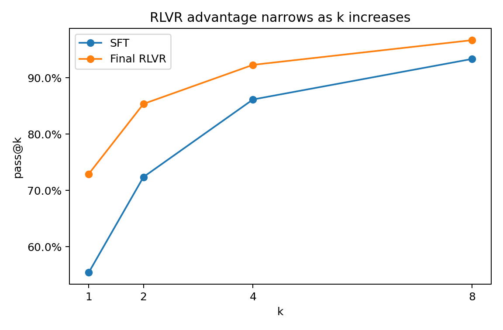
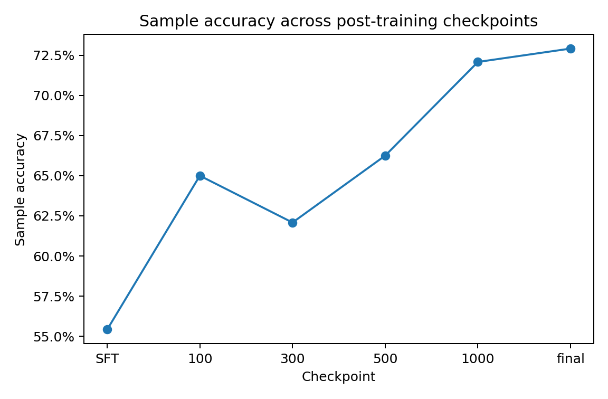
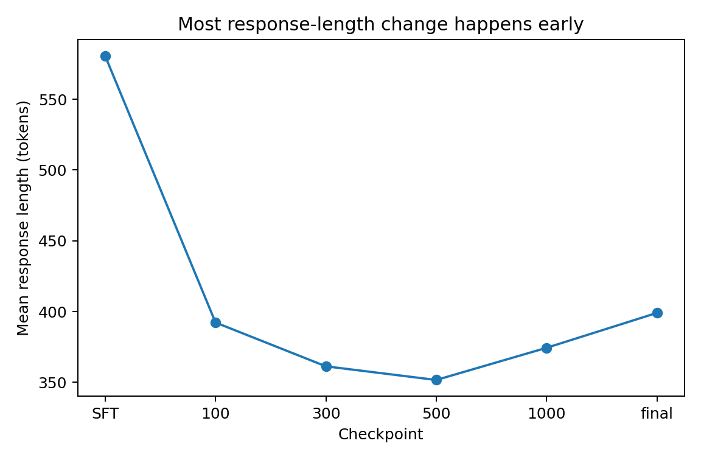

# RLVR Behavioral Probe

A small study of what changes during RL post-training. I am mainly looking at whether RLVR improves reasoning by putting more probability on solutions the SFT model can already reach, or by expanding observed solution coverage.

## Preliminary results

On 30 GSM8K test problems with 8 rollouts per problem and a 2048-token budget:

- Sample accuracy: **55.4% (SFT) -> 72.9% (final RLVR)**.
- The RL advantage shrinks with larger `k`: **+17.5 pp at pass@1** and **+3.3 pp at pass@8**.
- Across intermediate checkpoints, about **89–97% of positive gains** come from problems solved at least once by the SFT model.
- Most of the response-length change happens in the first 100 PPO steps, but accuracy continues to change afterward.

This is consistent with substantial probability sharpening, but `0/8` under SFT does not mean a solution had zero probability under the SFT policy.







## Setup

- Model family: Qwen2.5-1.5B
- SFT: `ns-0/qwen-2.5-1.5b-instruct-reasoning-sft`
- RLVR: `expx/qwen-2.5-1.5b-rlvr-ppo`
- Dataset: fixed 30-problem GSM8K test subset (`seed=42`)
- 8 rollouts per problem
- temperature 1.0, top-p 0.95, top-k 0, repetition penalty 1.0
- main generation budget: 2048 new tokens

For a problem with `K=8` rollouts, I call a positive gain **already covered** if SFT gets at least one rollout correct and RL gets more correct rollouts. If SFT gets `0/8` and RL gets at least one, I call it **observed coverage expansion**.

## Apple Silicon vLLM-Metal development runtime

The same public command uses `--engine vllm` on both CUDA and Apple Silicon. On macOS, `--device auto` should resolve to `mps`, and the installed vLLM-Metal plugin supplies the Metal runtime.

Requirements for the current official vLLM-Metal installer are macOS 15+, Apple Silicon, and native arm64 Python 3.12. Rosetta/x86_64 Python is not supported.

Check the host before installing:

```bash
sw_vers -productVersion
uname -m
python3 -c 'import platform; print(platform.machine())'
file "$(which python3)"
```

Install the official runtime into its default `~/.venv-vllm-metal` environment:

```bash
curl -fsSL https://raw.githubusercontent.com/vllm-project/vllm-metal/main/install.sh | bash
```

Then install only this project's extra dependencies. Do not install `requirements.txt` or `docker/requirements-vllm.txt` into this environment because those files may replace packages owned by the vLLM-Metal stack.

```bash
uv pip install \
  --python ~/.venv-vllm-metal/bin/python \
  -r requirements-macos-vllm.txt
```

Inspect the installed runtime without importing a model:

```bash
~/.venv-vllm-metal/bin/python - <<'PY'
import importlib.metadata
import platform
import sys

print("python:", sys.executable)
print("python version:", platform.python_version())
print("machine:", platform.machine())
for package in ["vllm", "vllm-metal", "transformers", "mlx"]:
    try:
        version = importlib.metadata.version(package)
    except importlib.metadata.PackageNotFoundError:
        version = "not installed"
    print(f"{package}: {version}")
PY
```

Metal results are for development, smoke tests, and small exploratory runs. CUDA vLLM remains the canonical measurement backend. Do not merge Metal rollouts into canonical CUDA probability estimates unless the experiment explicitly studies backend sensitivity.

The first Metal compatibility check must use the exact SFT checkpoint rather than silently replacing it with an MLX-community conversion. Create a one-question file from the canonical subset:

```bash
head -n 1 data/gsm8k_subset.jsonl > /tmp/gsm8k_subset_q0.jsonl
```

Then run:

```bash
~/.venv-vllm-metal/bin/python run_probe.py \
  --engine vllm \
  --device auto \
  --only-sft \
  --questions 1 \
  --rollouts 2 \
  --question-file /tmp/gsm8k_subset_q0.jsonl \
  --max-new-tokens 256 \
  --temperature 1.0 \
  --top-p 0.95 \
  --top-k 0 \
  --repetition-penalty 1.0 \
  --dtype bfloat16 \
  --sft-revision checkpoint-8-of-10 \
  --result-dir results_m5_smoke
```

If vLLM-Metal cannot load `ns-0/qwen-2.5-1.5b-instruct-reasoning-sft` at `checkpoint-8-of-10`, stop there and treat model conversion as a separate design decision. Do not substitute another checkpoint inside this smoke test.

A successful run should record `device_resolved` as `mps`, `runtime.platform` as `metal`, and `runtime.implementation` as `vllm-metal` in `results_m5_smoke/run_config.json`.

## RunPod vLLM image

Create a RunPod template with these settings:

```text
Container image: ghcr.io/unitedsnakes/rlvr-vllm:0.27.1
Container disk: 30 GB
Network volume: none
HTTP port: 8888
TCP port: 22
```

Secrets such as `HF_TOKEN` and the GitHub deploy key are runtime or template concerns. Never add them to the Dockerfile or commit them to this repository.

Configure these template environment variables:

```text
HF_TOKEN={{ RUNPOD_SECRET_huggingface_token }}
GITHUB_DEPLOY_KEY_B64={{ RUNPOD_SECRET_github_rlvr_deploy_key_b64 }}
RLVR_REPO=git@github.com:UnitedSnakes/rlvr_behavior_probe_runpod.git
RLVR_BRANCH=difficulty-bin-analysis
RLVR_REPO_DIR=/workspace/rlvr_behavior_probe_runpod
```

Use this exact Container start command:

```bash
/bin/bash -lc '/start.sh & start_pid=$!; rlvr-bootstrap > /workspace/rlvr-bootstrap.log 2>&1; bootstrap_status=$?; if [ "$bootstrap_status" -ne 0 ]; then printf "[rlvr-bootstrap] startup bootstrap failed with exit %s; pod remains available; rerun rlvr-bootstrap manually\n" "$bootstrap_status" >> /workspace/rlvr-bootstrap.log; fi; wait "$start_pid"'
```

`/start.sh` starts first so RunPod SSH/Jupyter remain available. The bootstrap then
configures the deploy key and prepares the repository. A bootstrap error is written
to `/workspace/rlvr-bootstrap.log` but is not allowed to kill the pod. After correcting
the cause, rerun `rlvr-bootstrap` manually.

Normal Docker-related pushes publish only a `sha-*` image tag. Test that image on a
fresh pod first. After the fresh-pod bootstrap and one-question vLLM smoke test pass,
manually dispatch the image workflow with `publish_stable=true` to promote the tested
build to `0.27.1`.

To back up a completed run automatically, expose `HF_TOKEN` through the
RunPod environment/Secret and pass a pre-existing Hugging Face Dataset repo:

```bash
python run_probe.py \
  --engine vllm \
  --only-rl \
  --rollouts 256 \
  --result-dir results_rl256_vllm \
  --upload-repo HKReporter/rlvr-behavior-probe-results
```

The local files are written first. A successful backup is stored under a
run-start timestamped path such as:

```text
runs/20260825T235312Z-results_rl256_vllm/
```

The destination Dataset repo must already exist. If backup fails, the local
result directory is preserved and the command exits unsuccessfully.

After bootstrap completes on a new pod, run this sanity check before running the probe:

```bash
which python
python - <<'PY'
import os
import sys
import torch
import vllm

print("python:", sys.executable)
print("torch:", torch.__version__)
print("cuda:", torch.version.cuda)
print("vllm:", vllm.__version__)
print("gpu:", torch.cuda.get_device_name(0))
print("spawn:", os.environ.get("VLLM_WORKER_MULTIPROC_METHOD"))
PY
```

For the fresh SHA-image top-k/JIT acceptance test, derive one canonical question:

```bash
head -n 1 data/gsm8k_subset.jsonl > /tmp/gsm8k_subset_q0.jsonl
```

Then run the non-canonical audit configuration that previously exercised the missing `ninja` path:

```bash
python run_probe.py \
  --engine vllm \
  --device cuda \
  --only-sft \
  --questions 1 \
  --rollouts 2 \
  --question-file /tmp/gsm8k_subset_q0.jsonl \
  --max-new-tokens 256 \
  --temperature 1.0 \
  --top-p 0.95 \
  --top-k 20 \
  --repetition-penalty 1.1 \
  --dtype bfloat16 \
  --sft-revision checkpoint-8-of-10 \
  --result-dir results_topk_smoke
```

This command is an infrastructure smoke test, not the canonical science protocol. Promote the SHA image to `0.27.1` only after both the canonical smoke and this top-k smoke pass on a fresh Pod.

## Reproduce the analysis

The raw rollout text is included, so reproducing the analysis does not require running the models again.

```bash
uv venv
source .venv/bin/activate
uv pip install -r requirements.txt

python summarize_results.py --result-dir results_2048_batched
python sanity_check_results.py \
  --result-dir results_2048_batched \
  --question-file data/gsm8k_subset.jsonl
python plot_results.py
```

For the intermediate checkpoints:

```bash
for d in trajectory/step-*; do
  python summarize_results.py --result-dir "$d"
done
```

If the answer-extraction logic changes, saved rollouts can be rescored without regenerating them:

```bash
python rescore_results.py --result-dir results_2048_batched --in-place
```

To regenerate rollouts:

```bash
python run_probe_batched.py \
  --questions 30 \
  --rollouts 8 \
  --max-new-tokens 2048 \
  --temperature 1.0 \
  --top-p 0.95 \
  --device auto \
  --dtype bfloat16 \
  --result-dir results_2048_batched \
  --resume
```

## Notes

This is a preliminary result from one model family, one dataset, one fixed 30-problem subset, and 8 rollouts per problem. I am using it as a starting point for larger-scale and more controlled tests of what RL changes during post-training.
